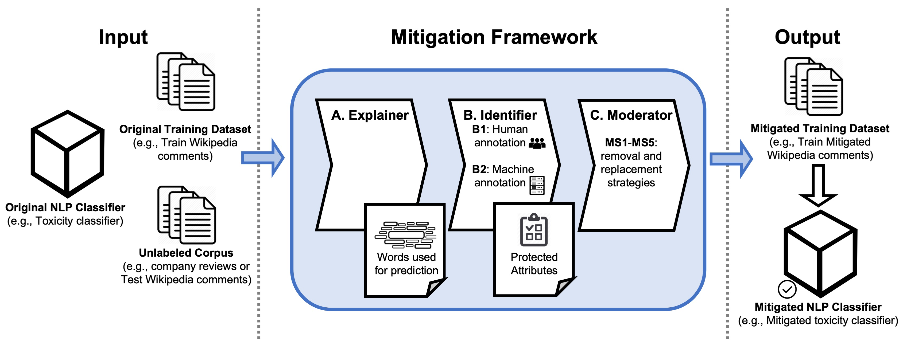

<div align="left">

<h1><b>NLPGuard</b></h1>
<p style="margin-top: -10px; font-size: 28px;"><i>A Framework for Mitigating the Use of Protected Attributes by NLP Classifiers</i></p>

</div>


[](https://nlpguard.readthedocs.io/en/latest/)
[](https://github.com/grecosalvatore/nlpguard/blob/main/LICENSE)
[](https://dl.acm.org/doi/10.1145/3686924)


This repository contains the code of the paper: <br>
[NLPGuard: A Framework for Mitigating the Use of Protected Attributes by NLP Classifiers
](https://dl.acm.org/doi/10.1145/3686924) **(Greco et al., 2024)**


**NLPGuard** is a **mitigation framework** that aims at reducing the use of **protected attributes** in the predictions of NLP classifiers without sacrificing predictive performance.

It currently supports NLP classifiers trained with the 🤗 [HuggingFace](https://huggingface.co/) library. 

<u>**NOTE**</u>: NLPGuard will be available as a Python package soon

# Table of Contents
- [NLPGuard Framework](#nlpguard-framework)
  - [Explainer](#explainer)
  - [Identifier](#identifier)
  - [Moderator](#moderator)
- [Setup](#setup)
- [Getting Started](#getting-started)
- [Examples](#examples)
- [Future Developments](#future-developments)
- [References](#references)
- [Future Developments](#future-developments)


# NLPGuard Framework


**NLPGuard** takes an existing NLP classifier, its training dataset, and an unlabeled corpus (e.g., test set or new data) used for predictions as input to produce a mitigated training
corpus that **significantly reduces the learning that takes place on protected attributes** without sacrificing
classification accuracy. 

NLPGuard comprises three components: 
* [**Explainer**](#explainer): extracts the most important predictive words used by the classifier to make predictions;
* [**Identifier**](#identifier): determines which of these words are protected attributes;
* [**Moderator**](#moderator): modifies the original training dataset to produce a new mitigated version to re-train the classifier.

## Explainer
The **Explainer** leverages XAI techniques to extract the list of most important words used by the model for predictions on the unlabeled corpus.
It first computes the words' importance within each prediction (*local explanation*), and then aggregate them across the entire corpus (*global explanation*).

NLPGuard currently supports the following XAI techniques:
* Integrated Gradients ✅️

Other will be added soon:
* SHAP ⚙

## Identifier
The **Identifier** determines which of the most important words are related to protected attributes by annotating each word with one of the following labels:
* **none-category**: the word is not a protected attribute;
* **protected-category**: the word is a protected attribute;
    * **Age**
    * **Disability**
    * **Gender reassignment**
    * **Marriage and civil partnership**
    * **Pregnancy and maternity**
    * **Race**
    * **Religion and belief**
    * **Sex (Gender)**
    * **Sexual orientation**
    
NLPGuard currently supports the following techniques to annotate protected attributes:
* Machine-in-the-loop (exploiting LLMs annotations)
  - GPT-based Identifier ✅️
  - LlaMa-based Identifier ✅️

And other techniques will be available soon:
* Human-in-the-loop (exploiting human crowd workers) ⚙
* Pre-defined list of protected attributes: ⚙

**Note**: 
- The GPT-based annotation requires a openAI API key (you can get one [here](https://beta.openai.com/))
- The LlaMa-based annotation requires a Hugging Face access token (you can get it [here](https://huggingface.co/settings/tokens)) and granted access to the specific LlaMa model you want to use ([here](https://huggingface.co/meta-llama))

<u>**Warning**</u>: The effectiveness of the LlaMa-based annotation has not been evaluated 

## Moderator
The **Moderator** mitigates the protected attributes by modifying the original training dataset that can be used to train a new mitigated classifier.

NLPGuard currently supports the following mitigation strategies:
- ***Words Removal***: removes the protected attributes identified from the training dataset ✅
- ***Sentences Removal***: removes the sentences containing the protected attributes identified from the training dataset ✅
- ***Words Replacement with Synonyms***: replaces the protected attributes identified *k* synonyms from the training dataset ✅
- ***Words Replacement with Hypernym***: replaces the protected attributes identified with their hypernym from the training dataset ⚙


# Setup
1) Create and Start a new environment:
```sh
conda create -n nlpguard-env python=3.8 anaconda
conda activate nlpguard-env
```
2) Install the required packages:
```sh
pip install -r requirements.txt
```

# Getting Started
```python
from framework.mitigation_framework import MitigationFramework
from transformers import AutoModelForSequenceClassification, AutoTokenizer
import pandas as pd

id2label = {0: "non-toxic", 1: "toxic"}

model_name_or_path = "your_trained_model_path"

# Load the unlabaled corpus from disk (e.g., test set). Ths is the corpus of texts to explain and extract most important words
df_unalabaled_corpus = pd.read_csv("saved_datasets/unlabeled_corpus.csv")
texts_unlabeled_corpus = df_unalabaled_corpus["text"].tolist()

# Load your model and tokenizer
model = AutoModelForSequenceClassification.from_pretrained(model_name_or_path)
tokenizer = AutoTokenizer.from_pretrained(model_name_or_path)

# Instantiate the Mitigation Framework
mf = MitigationFramework().initialize_mitigation_framework(id2label=id2label,
                                                           use_case_name="toxicity-classification")

# Labels to per perform the explanations on (e.g., 0: non-toxic, 1: toxic)
label_ids_to_explain = [0, 1]

# Run the explainer. It returns a dictionary with, for each label id, the list of most important words
output_dict = mf.run_explainer(model,  # Explained model
                               tokenizer, # Model Tokenizer
                               texts_unlabeled_corpus,  # Unlabeled corpus of texts to explain and extract most important words
                               label_ids_to_explain,  # Labels to explain
                               device="cuda:0"  # Device to run the explainer on
                               )

# Identify protected attributes from the 400 most important words extracted by the explainer for each label
number_most_important_words = 400

#Run the identifier to identify the protected attributes from the most important words extracted by the explainer
df_annotated, protected_attributes, protected_attributes_dict = mf.run_identifier(output_dict,  # Output of the explainer
                                                                                  number_most_important_words=number_most_important_words  # Number of most important words to consider
                                                                                  )

# Load the training dataset to mitigate
df_train = pd.read_csv("saved_datasets/test.csv")

# If this is True, the protected attributes are mitigated separately for each label, otherwise independently of the label
# For instance, if it is True, the protected attributes identified for the "nurse" label will be used to mitigate only the examples which original label is "nurse" and the same for "non-nurse"
# If is False, the protected attributes identified for all the labels (e.g., "non-nurse" and "nurse" label) will be used to mitigate all the examples, independently of the original label
mitigate_each_label_separately = False

# Select the mitigation strategy to use
mitigation_strategy = "words_removal"  # Mitigation strategy to use. It can be "words_removal" or "sentences_removal"

# Run the moderator to mitigate the protected attributes identified by the identifier in the training dataset
df_train_mitigated = mf.run_moderator(df_train,  # Training dataset to mitigate
                                      tokenizer,  # Model tokenizer
                                      protected_attributes_dict,  # Protected attributes identified by the identifier
                                      mitigation_strategy=mitigation_strategy,  # Mitigation strategy to use
                                      text_column_name="cleaned_text",  # Name of the column containing the texts
                                      label_column_name="label",  # Name of the column containing the labels
                                      mitigate_each_label_separately=mitigate_each_label_separately,  # Mitigate the protected attributes for each label separately or not
                                      batch_size=128  # Batch size to use for the mitigation
                                      )

# Save the mitigated dataset to disk
df_train_mitigated.to_csv("saved_datasets/test_mitigated.csv", index=False)
```
# Examples 📝
Full examples will be available soon.

# Future Developments
- ✅️ Integrate LlaMa annotation of protected attributes for the Identifier component
- ⚙️ Integrate SHAP for the Explainer component
- ⚙️ Integrate other XAI techniques for the Explainer component
- ⚙️ Add mitigation techniques based on data manipulation

# References
If you use NLPGuard, please cite the following paper:
```bibtex
@article{10.1145/3686924,
author = {Greco, Salvatore and Zhou, Ke and Capra, Licia and Cerquitelli, Tania and Quercia, Daniele},
title = {NLPGuard: A Framework for Mitigating the Use of Protected Attributes by NLP Classifiers},
year = {2024},
issue_date = {November 2024},
publisher = {Association for Computing Machinery},
address = {New York, NY, USA},
volume = {8},
number = {CSCW2},
url = {https://doi.org/10.1145/3686924},
doi = {10.1145/3686924},
journal = {Proc. ACM Hum.-Comput. Interact.},
month = nov,
articleno = {385},
numpages = {25},
keywords = {bias, crowdsourcing, fairness, large language models, natural language processing, protected attributes, toxic language}
}
```

# Authors
- Salvatore Greco, *Politecnico di Torino*
- Ke Zhou, *Nokia Bell Labs*
- Licia Capra, *University College London*
- Tania Cerquitelli, *Politecnico di Torino*
- Daniele Quercia, *Nokia Bell Labs*